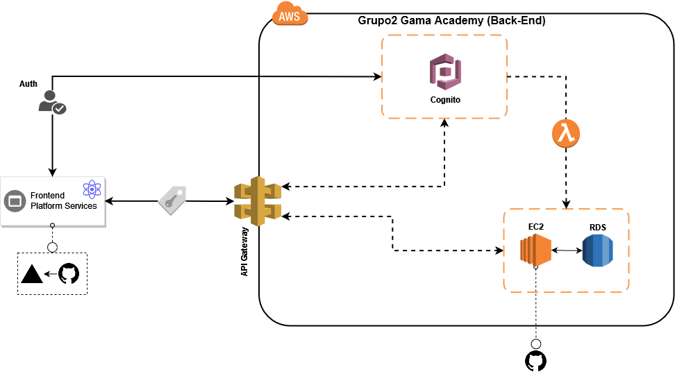

<!-- markdownlint-disable-next-line -->
## Versão Fron-end

<p align="center">
  <a href="https://veller.squad2.tech/" rel="noopener" target="_blank"></a>
</p>

<h3 align="center">Nunca mais deixe de viajar por não ter companhia</h1>

**Veller** é um aplicativo que proporciona a conexão (match) entre pessoas que não se conhecem, mas desejam viajar para determinado local, na mesma data e podem combinar de fazer a viagem juntas.

- _Missão_: Melhorar a experiência de viagem dos nossos usuários através da conexão entre pessoas.

- _Visão_: Ser uma empresa global, que conecta viajantes do mundo todo.

- _Valores_: Paixão, Respeito e Conectividade.

[](https://github.com/mui/material-ui/blob/HEAD/LICENSE)

<br/>


## 💻 Arquitetura do Projeto

<p align="center">
  
</p>

## 🧪 Tecnologias

Esse projeto foi desenvolvido com as seguintes tecnologias:

- [ReactJS](https://pt-br.reactjs.org/)
- [Amplify](https://docs.amplify.aws/)
- [Material-ui](https://mui.com)
- [JavaScript](https://www.javascript.com/)
- [Vercel](https://aws.amazon.com)


## 🚀 Como executar

Clone o projeto e acesse a pasta do mesmo.

```bash
$ git clone https://github.com/maxmelodia/squad2-gama-front.git
$ cd squad2-gama-front
```

Para iniciá-lo, siga os passos abaixo:
```bash
# Instalar as dependências
$ npm i

# Iniciar o projeto
$ npm start
```

O app estará disponível no seu browser pelo endereço http://localhost:3000.

## 💎 Patrocinador 
<p align="center">
  <a href="https://www.gama.academy/" rel="noopener sponsored" target="_blank"></a>
</p>

---

Colaboradores: 

[](https://github.com/maxmelodia) [](https://github.com/maxmelodia) [](https://www.linkedin.com/in/maxwell-roberto/)

[](https://github.com/Arimayara) [](https://github.com/Arimayara) [](https://www.linkedin.com/in/ariany-santos/)

<br>

## 📝 License

Esse projeto está sob a licença MIT. Veja o arquivo [LICENSE](LICENSE.md) para mais detalhes.

---

Feito com :orange_heart: by Veller 👋🏻 [Siga Veller](https://veller.squad2.com.br/)
